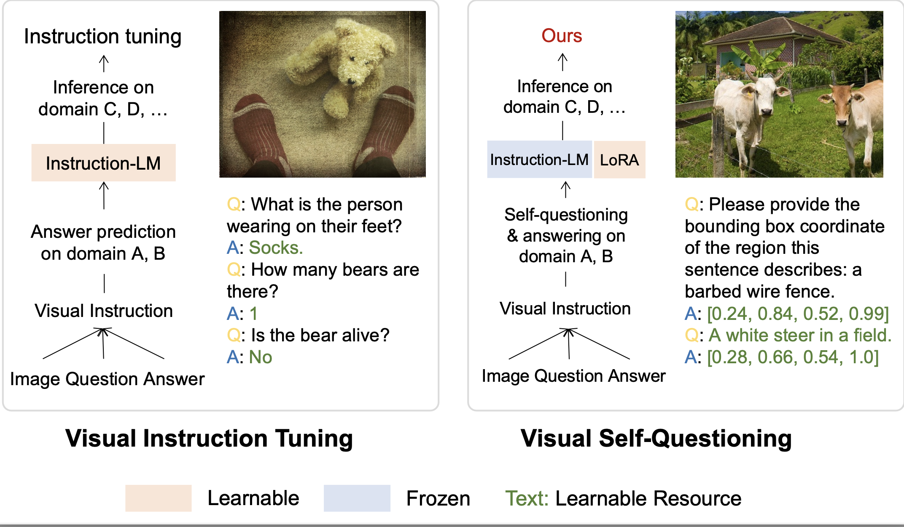

# SQ-LlaVA: Self-questioning for Vision-Language Assistant
<em> In broad real-world scenarios, proactively asking a question requires more understanding and background knowledge than answering.</em>

<strong> SQ-LlaVA: Self-questioning for Vision-Language Assistant </strong> [[paper](https://arxiv.org/pdf/2403.11299.pdf)]

[Guohao Sun](https://urchinpie.com/), [Can Qin](https://canqin.tech/), [Jiamian Wang](https://jiamian-wang.github.io/), [Zeyuan Chen](https://www.linkedin.com/in/zeyuan-chen-/), [Ran Xu](https://xurantju.github.io/), [Zhiqiang Tao](https://ztao.cc/)

<p align="center">
   <br>
  A high-level comparison between visual instruction tuning and visual self-questioning (ours) for vision-language assistant.
</p>

## 🔥 News
* **`2024.07.01`** 🌟 Our paper has been accepted by ECCV 2024.
* **`2024.03.10`** 🌟 Our paper and code was released!


## Contents
- [Install](#install)
- [Model Zoo](./docs/MODEL_ZOO.md)
- [Dataset](#data)
- [Train](#train)
- [Evaluation](#evaluation)

## Install

1. Install Package
```Shell
conda create -n llava python=3.10 -y
conda activate llava
pip install --upgrade pip  # enable PEP 660 support
cd SQ-LLaVA
pip install -e .
```

2. Install additional packages for training cases
```Shell
pip install -e ".[train]"
pip install flash-attn --no-build-isolation
```

## Demo (visual self-questioning)

To test visual self-questioning, please run [run_sq.sh](https://github.com/heliossun/SQ-LLaVA/blob/main/demo/run_sq.sh)
with the following settings.
- `--version v1_sq`: use the self-questioning template.
- `--n_shot 3`: the number of generated questions.

```bash
  CUDA_VISIBLE_DEVICES=0 python visual_questioning.py \
  --model_path path/to/sqllava-v1.7-7b-lora-gpt4v-cluster-sq-vloraPTonly \ 
  --model_base Lin-Chen/ShareGPT4V-7B_Pretrained_vit-large336-l12_vicuna-7b-v1.5 \
  --conv-mode="v1_sq" \
  --lora_pretrain path/to/sqllava-v1.7-7b-lora-gpt4v-cluster-sq-vloraPTonly \
  --n_shot 3
```

## Data

| Data file name | Size |
| --- | ---: |
| [sharegpt4v_instruct_gpt4-vision_cap100k.json](https://huggingface.co/datasets/Lin-Chen/ShareGPT4V/blob/main/sharegpt4v_instruct_gpt4-vision_cap100k.json) | 134 MB |
| [share-captioner_coco_lcs_sam_1246k_1107.json](https://huggingface.co/datasets/Lin-Chen/ShareGPT4V/blob/main/share-captioner_coco_lcs_sam_1246k_1107.json) | 1.5 GB |
| [sharegpt4v_mix665k_cap23k_coco-ap9k_lcs3k_sam9k_div2k.json](https://huggingface.co/datasets/Lin-Chen/ShareGPT4V/blob/main/sharegpt4v_mix665k_cap23k_coco-ap9k_lcs3k_sam9k_div2k.json) | 1.2 GB |
| [LLaVA](https://github.com/haotian-liu/LLaVA/blob/main/docs/Data.md) | 400 MB |
### Prepare Images

For your convinence, please follow [`download_data.sh`](https://github.com/heliossun/SQ-LLaVA/blob/main/download_data.sh) for data preparation.

- LAION-CC-SBU-558K: [images.zip](https://huggingface.co/datasets/liuhaotian/LLaVA-Pretrain/blob/main/images.zip)
- COCO: [train2017](http://images.cocodataset.org/zips/train2017.zip)
- WebData: [images](https://drive.google.com/drive/folders/1tCUQ-sq6vdshZVkF0ZeF3K4eztkXJgax?usp=sharing). Only for academic usage.
- SAM: [images](https://ai.meta.com/datasets/segment-anything-downloads/). We only use 000000~000050.tar for now.
- GQA: [images](https://downloads.cs.stanford.edu/nlp/data/gqa/images.zip)
- OCR-VQA: [download script](https://drive.google.com/drive/folders/1_GYPY5UkUy7HIcR0zq3ZCFgeZN7BAfm_?usp=sharing). We save all files as `.jpg`
- TextVQA: [trainvalimages](https://dl.fbaipublicfiles.com/textvqa/images/train_val_images.zip)
- VisualGenome: [part1](https://cs.stanford.edu/people/rak248/VG_100K_2/images.zip), [part2](https://cs.stanford.edu/people/rak248/VG_100K_2/images2.zip)

Then, organize the data as follows in `./mixTraindata`:

```none
Visual-self-qa
├── ...
├── mixTraindata
│   ├── llava
│   │   ├── llava_pretrain
│   │   │   ├── images
│   ├── coco
│   │   ├── train2017
│   ├── sam
│   │   ├── images
│   ├── gqa
│   │   ├── images
│   ├── ocr_vqa
│   │   ├── images
│   ├── textvqa
│   │   ├── train_images
│   ├── vg
│   │   ├── VG_100K
│   │   ├── VG_100K_2
│   ├── share_textvqa
│   │   ├── images
│   ├── web-celebrity
│   │   ├── images
│   ├── web-landmark
│   │   ├── images
│   ├── wikiart
│   │   ├── images
│   ├── share-captioner_coco_lcs_sam_1246k_1107.json
│   ├── sharegpt4v_instruct_gpt4-vision_cap100k.json
│   ├── sharegpt4v_mix665k_cap23k_coco-ap9k_lcs3k_sam9k_div2k.json
│   ├── blip_laion_cc_sbu_558k.json
│   ├── llava_v1_5_mix665k.json
├── ...
```


## Train
Training consists of two stages: (1) feature alignment stage; (2) visual self-questioning instruction tuning stage, teaching the model to ask questions and follow multimodal instructions.

To train on fewer GPUs, you can reduce the `per_device_train_batch_size` and increase the `gradient_accumulation_steps` accordingly. Always keep the global batch size the same: `per_device_train_batch_size` x `gradient_accumulation_steps` x `num_gpus`.

### Hyperparameters
Both hyperparameters used in pretraining and finetuning are provided below.

1. Pretraining

| Hyperparameter | Global Batch Size | Learning rate | Epochs | Max length | Weight decay |
| --- | ---: | ---: | ---: | ---: | ---: |
| SQ-LLaVA | 256 | 1e-3 | 1 | 2048 | 0 |

2. Finetuning

| Hyperparameter | Global Batch Size | Learning rate | Epochs | Max length | Weight decay |
| --- | ---: | ---: | ---: | ---: | ---: |
| SQ-LLaVA | 128 | 2e-4 | 1 | 2048 | 0 |


### Pretraining (feature alignment)

Training script with DeepSpeed ZeRO-2: [`pretrain.sh`](https://github.com/heliossun/SQ-LLaVA/blob/main/scripts/pretrain_clu.sh).

- `--mm_projector_type cluster`: the prototype extractor & a two-layer MLP vision-language connector.
- `--vision_tower openai/clip-vit-large-patch14-336`: CLIP ViT-L/14 336px.
- `--vit_lora_enable`: optimize vision encoder using vit lora.
After pretraining, put the folder `./checkpoints/path/to/pretrain` under `./checkpoints/projector`.

We have also provided a pre-trained weights for the pretraining stage, please download [here](https://huggingface.co/ZachSun/Sophon-projector-cluster-pretrain) and put in `./checkpoints/projector`.

### Visual Instruction Tuning

Instruction tuning:
Training script with DeepSpeed ZeRO-3 and lora: [`finetune_lora_clu_sq.sh`](https://github.com/heliossun/SQ-LLaVA/blob/main/scripts/finetune_lora_clu_sq.sh).


- `--mm_projector_type cluster`: the prototype extractor & a two-layer MLP vision-language connector.
- `--mm_projector_type mlp2x_gelu`: a two-layer MLP vision-language connector.
- `--vision_tower openai/clip-vit-large-patch14-336`: CLIP ViT-L/14 336px.
- `--image_aspect_ratio pad`: this pads the non-square images to square, instead of cropping them; it slightly reduces hallucination.
- `--group_by_modality_length True`: this should only be used when your instruction tuning dataset contains both language (e.g. ShareGPT) and multimodal (e.g. LLaVA-Instruct). It makes the training sampler only sample a single modality (either image or language) during training, which we observe to speed up training by ~25%, and does not affect the final outcome.
- `--version v1_sq`: training for visual self-questioning.
- `--vit_lora_enable`: optimize vision encoder using vit lora. 


## Evaluation
Prepare data
Please download raw images of datasets (COCO, Flickr, nocaps, conceptual) for image captioning tasks.
1. Evaluate models on image captioning.
See [captioning.sh](https://github.com/heliossun/SQ-LLaVA/blob/main/scripts/eval/captioning.sh) on 4 datasets.
2. Evaluate models on a diverse set of 12 benchmarks. To ensure the reproducibility, we evaluate the models with greedy decoding. We do not evaluate using beam search to make the inference process consistent with the chat demo of real-time outputs.

See [Evaluation.md](./docs/Evaluation.md).


## Citation
If you find this code to be useful for your research, please consider citing.
```bash
@inproceedings{sun2024sq,
  title={SQ-LLaVA: Self-Questioning for Large Vision-Language Assistant},
  author={Sun, Guohao and Qin, Can and Wang, Jiamian and Chen, Zeyuan and Xu, Ran and Tao, Zhiqiang},
  year = {2024},
  booktitle = {ECCV},
}
```

## Acknowledgement

- [LLaVA](https://github.com/haotian-liu/LLaVA): the codebase we built upon.


