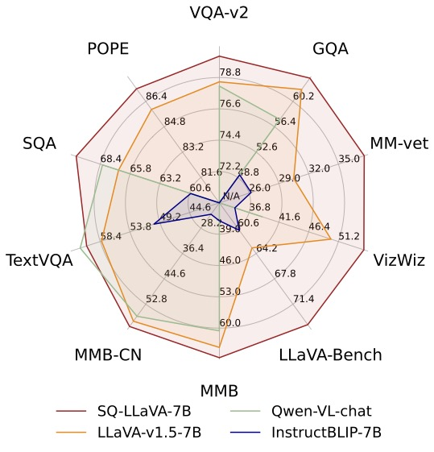

# Model Zoo

## SQ-LLaVA-v1.0

| Version | Size | Data | Checkpoint | VQAv2 | GQA | VizWiz | SQA | TextVQA | POPE  | MM-Bench | MM-Bench-CN  | LLaVA-Bench-Wild | MM-Vet |
|----------|----------|-----------|-----------|---|---|---|---|---|---|---|---|---|---|---|---|
| LLaVA-1.5 | 7B | LLaVA-v1.5 | [ZachSun/sqllava-7b-vlora-665k](https://huggingface.co/ZachSun/sqllava-7b-vlora-665k) | 79.2 | 62.8 | 54.0 | 68.9 | 58.6 | 87.7  | 66.2 | 58.1  | 66.3 | 32.5 |
| LLaVA-1.5 | 13B | LlaVA-v1.5 | [ZachSun/sqllava-13b-vlora-665k](https://huggingface.co/ZachSun/sqllava-13b-vlora-665k) | 80.1 | 63.6 | 54.6 | 69.8 | 60.2 | 87.7  | 68.7 | 62.0  | 74.6 | 35.5 |
| LLaVA-1.5 | 7B | ShareGPT4V | [ZachSun/sqllava-7b-vlora-spt4v](https://huggingface.co/ZachSun/sqllava-7b-vlora-spt4v) | 80.3 | 63.7 | 55.3 | 70.5 | 60.5 | 87.2  | 66.6 | 60.0  | 74.3 | 37.6 |
| LLaVA-1.5 | 13B | ShareGPT4V | [ZachSun/sqllava-13b-vlora-spt4v](https://huggingface.co/ZachSun/sqllava-13b-vlora-spt4v) | 81.3 | 65.0 | 58.2 | 71.5 | 61.9 | 87.4  | 68.5 | 62.5 | 80.7 | 39.7 |

    
  LLaVA-1.5 achieves SoTA performance across 11 benchmarks.

